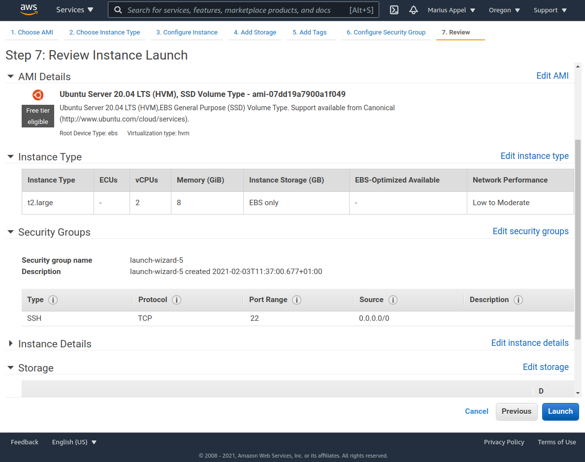

```{r setup, include=FALSE}
knitr::opts_chunk$set(echo = TRUE)
knitr::opts_chunk$set(eval = TRUE)
```


One of the advantages of today's cloud computing platforms is that many of them include a large catalog of open data. This includes petabyte-scale collections of satellite imagery as from the Landsat and Copernicus missions. Downloading
larger amounts of such data can be frustrating, time-consuming, or simply unfeasible.

Coming from a local analysis workflow where imagery lies somewhere on your disk, there are two important differences that require some additional work on cloud platforms. First, it may not be straightforward to discover the data. For example, the [Sentinel-2 imagery in the Google Cloud](https://cloud.google.com/storage/docs/public-datasets/sentinel-2#dataset_access) is indexed as a 2 GB CSV file (or available in BigQuery). Performing essential queries like _"find all images that spatially intersect with a region of interest and have been recorded within a certain period of time"_ may involve some effort and depends on how 
the data is indexed. Second, image data is located on object storage and the communication works over HTTP.
For typical image file formats such as JPEG2000, only complete files can be queried even if small 
blocks or pixels at lower resolution are needed. Assuming a common size of hundreds of megabytes per image file, this leads to a lot of unneeded data transfer if we work for smaller regions and/or at lower resolution. 

Two recent developments that address these issues are the [SpatioTemporal Asset Catalog (STAC)](https://stacspec.org) and the [Cloud Optimized GeoTIFF (COG)](https://www.cogeo.org) file format. This blog post briefly introduces STAC and COGs and presents ongoing developments that make it easier to analyse Earth observation data on cloud platforms using R. 
We use a small machine on Amazon Web Services (AWS) and the open [Sentinel-2 COG catalog](https://registry.opendata.aws/sentinel-2-l2a-cogs) containing Level-2A (surface reflectance) imagery from the Sentinel-2 satellites in a few examples by combining the R packages `rstac` and `gdalcubes`.


# SpatioTemporal Asset Catalog (STAC)

[STAC](https://stacspec.org) is an emerging specification and ecosystem to describe, find and work with geospatial datasets in a cloud-native manner using [static metadata files](https://github.com/radiantearth/stac-spec) or an [API](https://github.com/radiantearth/stac-api-spec). Its goal is to get away from proprietary APIs for exposing geospatial assets and thus increase interoperability and ease of use across domains such as [Optical](https://github.com/radiantearth/stac-spec/blob/master/extensions/eo/README.md), [SAR](https://github.com/stac-extensions/sar), [LIDAR](https://github.com/stac-extensions/pointcloud) or [ML](https://github.com/stac-extensions/label). The main focus of STAC is to expose metadata for search and discovery so that interested parties get aware of data made available, e.g. through finding them in a normal search engine such as Google or Bing. Apart from search and discovery, STAC is extensible with [various extensions](https://github.com/radiantearth/stac-spec/blob/master/extensions/README.md) already defined and it it also possible to link to additional metadata and other related information.

STAC is a set of four complimentary specifications:

* The [**Collection** specification]() is meant to expose high-level information about a dataset with similar characteristics, e.g. all imagery captured in the Sentinel 2 mission. 
* The **Item** specification describes single parts of the mission, e.g. a single Sentinel 2 image with all bands included. The files exposed by an Item are the **Assets**.
* The **Catalog** specification allows to group Collections and Items by various aspects so that they are easier to browse through.
* **STAC API** is the last specification in this list, which is a superset of [OGC API - Features](https://www.ogc.org/standards/ogcapi-features) and aligns with their extensions as well.

The ecosystem of STAC software and catalogs is growing. [STAC Index](https://stacindex.org/) gives an overview over [STAC catalogs and APIs](https://stacindex.org/catalogs). The [list of software](https://stacindex.org/ecosystem) with [R-based implementations](https://stacindex.org/ecosystem?language=R) is so far limited to the `rstac` CRAN package.

A number of interesting talks about cloud native geospatial with strong focus on STAC can be found in the YouTube playlist of the [Cloud Native Geospatial Outreach Day 2020](https://www.youtube.com/playlist?list=PL3QzFgBMGnbQWbW-V09AzSfCbnf6Q87Rq).

# Cloud Optimized GeoTIFF (COG) 

COGs can be seen as special GeoTIFF files where image data is stored block-wise (tiled) and the order of metadata entries and 
pixel data on full resolution and optional overview images follows a specific structure. 
More details can be found on the [COG website](https://www.cogeo.org/) and the [GDAL COG driver documentation](https://gdal.org/drivers/raster/cog.html). If we request a block of pixels, COGs allow to automatically find out which bytes of the file must be read and hence HTTP GET range requests become possible. The availability of overview images within a COG is essential to allow fast (on-the-fly) analysis on low resolution (as we know from [Google Earth Engine](https://earthengine.google.com/), where only pixels that are actually displayed on the screen are computed). Fortunately, [GDAL](https://gdal.org/) not only supports reading and writing COGs but also includes [virtual file systems](https://gdal.org/user/virtual_file_systems.html) to access files over HTTP and from object storage of cloud providers including AWS S3 and Google Cloud Storage. 


# Launching an EC2 instance on AWS

We launch a rather cheap machine (t3.large) on AWS in the region us-west-2 (Oregon), where the 
data is located. Using the AWS management console makes this straightforward.

{ style="width:70%; margin:auto; display: block;"}

Since our machine instance uses a blank Ubuntu image, we start with connecting over SSH and installing some
system libraries and the most recent R version:

```
sudo apt update
sudo apt install libgdal-dev libcurl4-openssl-dev libnetcdf-dev libudunits2-dev gdal-bin libmagick++-dev pandoc
sudo apt-key adv --keyserver keyserver.ubuntu.com --recv-keys E298A3A825C0D65DFD57CBB651716619E084DAB9
sudo add-apt-repository 'deb https://cloud.r-project.org/bin/linux/ubuntu focal-cran40/'
sudo apt update && sudo apt install r-base
```

If you prefer to use RStudio, it is also straightforward to install RStudio Server and add a security rule to make it accessible on port 8787 in the AWS management console. Afterwards, we can install quite a few R packages:

```{r, eval = FALSE}
install.packages(c("sf", "stars", "magick", "rmarkdown", "ncdf4", "Rcpp", "jsonlite", "RcppProgress", "rstac", "tmap"))
```

To avoid these step when launching another instance, we might collect everything in a Docker image and use additional services of 
the cloud platforms (e.g., Amazon Elastic Container Service).


# Querying images with `rstac`

STAC API is a modern well-documented RESTful and JSON-based API. To communicate with STAC API instances from R, the 
 [`rstac` package](https://cran.r-project.org/package=rstac) has been developed as part of the 
[Brazil Data Cube project](http://brazildatacube.org).

Below, we connect to the open [Earth Search API](https://www.element84.com/earth-search) and perform 
a query on the Sentinel-2 COG collection to find all images that intersect with a bounding box over the city of Geneva from 2020.


```{r}
library(rstac) 
s = stac("https://earth-search.aws.element84.com/v0")

items <- s %>%
    stac_search(collections = "sentinel-s2-l2a-cogs",
				bbox = c(6.1,46.2,6.2,46.3), # Geneva
				datetime = "2020-01-01/2020-12-31",
				limit = 500) %>%
    post_request() 

items
```

The result is a list containing some general metadata (e.g., STAC version, STAC extensions used, and the number of returned and matching features) as well as the list of features. Each feature corresponds to an image and contains a unique identifier,
the spatial footprint and bounding box, further properties (recording datetime and per image metadata such as cloud cover percentage), and a list of assets. Each asset contains a URL that points to an image file and again may include further metadata. Here, the spectral bands are individual assets but assets may also point to non-image data.  Notice that STAC API instances may limit the maximum number of resulting features per request. In the example, 147 images were returned.

Printing an asset element of one of the images shows that links to imagery are simply URLs of GeoTIFF files located on an AWS S3 bucket.

```{r}
items$features[[4]]$assets$B04
```

To perform server-side filtering of images by properties such as cloud cover percentage, we can modify the query object returned from `stac_search()` and add further query parameters. However, this only works if the STAC API service supports the [STAC API Query extension](https://github.com/radiantearth/stac-api-spec/tree/master/item-search#query). Below, we add a `query` HTTP POST parameter to return only images with less than 20% cloud coverage.  

```{r}
q <- s %>% stac_search(collections = "sentinel-s2-l2a-cogs",
				bbox = c(6.1,46.2,6.2,46.3), # Geneva
				datetime = "2020-01-01/2020-12-31",
				limit = 500)
q$params$query = "{\"eo:cloud_cover\": {\"lt\": 10}}" # JSON property filter
q %>% post_request() 
```
This functionality is quite important for the analysis of larger areas or long time series in order to deal with limits on the number of returned items. The extension is currently in the pilot stage and might be replaced by CQL filters in the future (following OGC API - Features). In the following smaller examples, we therefore simply request all available images and filter by cloud cover on the client side.  


# On-demand data cubes with `gdalcubes`

The `gdalcubes` package creates and processes regularly discretised data cubes on demand from satellite image collections, where images may have different spatial reference systems, spectral bands may have different pixel sizes, images may overlap, and images may be recorded irregularly over time. It uses GDAL to read and warp images and hence directly works with COGs in cloud computing environments. An introduction into the package can be found in an earlier [r-spatial blog post](https://www.r-spatial.org/r/2019/07/18/gdalcubes1.html) and on [GitHub](https://github.com/appelmar/gdalcubes_R).

The latest development version of `gdalcubes` ([see GitHub](https://github.com/appelmar/gdalcubes_R)) adds a function that converts STAC feature collections (as returned from the `rstac` package) to image collections. Compared to local processing, creating image collections from STAC is very fast, because no metadata must be read from the files.
The function `stac_image_collection()` expects a STAC feature collection as a list and takes further arguments to filter images by metadata (e.g. cloud coverage) or by asset names (e.g., spectral bands), and to modify URLs of images. The latter is important to explain GDAL how to access URLs. By default `/vsicurl/` is added as a prefix to URLs to make use of GDAL's virtual file system. 

To get started, we first need to install the GitHub version of `gdalcubes`, which can be done from the command line by:

```
git clone --recursive https://github.com/appelmar/gdalcubes_R
cd gdalcubes_R && R CMD INSTALL .
```

Afterwards, we load the package and use the result of the previous STAC request to create an image collection from all images
with less than 20% clouds.

```{r}
library(gdalcubes)
system.time(col <- stac_image_collection(items$features, property_filter = function(x) {x[["eo:cloud_cover"]] < 20}))
col
```

Notice that the conversion tries to find out which assets correspond to spectral bands automatically based on the availability of `eo:bands` metadata. In this case, the Sentinel-2 SCL layer that can be used for cloud masking has not been added because it has no `eo:bands` properties. We can still add it by explicitly listing assets by name:

```{r}
assets = c("B01","B02","B03","B04","B05","B06", "B07","B08","B8A","B09","B11","SCL")
col = stac_image_collection(items$features, asset_names = assets, 
                            property_filter = function(x) {x[["eo:cloud_cover"]] < 20})
```

The warning tells us that metadata is missing for the SCL assets. In the future, we might make 
this a bit more clever by considering further STAC asset metadata (such as the asset type). 

Thanks to `gdalcubes`, we do not need to care about differences of the spatial resolution of the assets and different spatial reference systems and spatial overlaps of the images.  After creating the image collection, we can work with `gdalcubes` as with any local image collection. For example, the following script generates a cloud-free mosaic image at 20m spatial resolution for Geneva 2020 by computing for each pixel the median value of the visible spectral bands over time, for all pixels that have not been classified as clouds or cloud shadows. 

```{r}
v = cube_view(srs = "EPSG:3857",  extent = list(t0 = "2020-01-01", t1 = "2020-12-31",
              left = 674052, right = 693136,  top = 5821142, bottom = 5807088),
              dx = 20, dy = 20, dt = "P1D", aggregation = "median", resampling = "average")

S2.mask = image_mask("SCL", values=c(3,8,9)) # clouds and cloud shadows
gdalcubes_options(threads = 4) 
raster_cube(col, v, mask = S2.mask) %>%
    select_bands(c("B02","B03","B04")) %>%
    reduce_time(c("median(B02)", "median(B03)", "median(B04)")) %>%
    plot(rgb = 3:1, zlim=c(0,1800)) %>% system.time()
```


# More examples

Since we have access to *all* Sentinel-2 images, we can simply jump to any other area on Earth. We need to request available
images again using STAC, create a gdalcubes image collection, and finally create and process the data as a data cube. 

In the following example, we create a monthly animation of the normalized difference vegetation index over some cropland in Kansas, US in 2019. 


```{r,warning=FALSE}
items <- s %>%
    stac_search(collections = "sentinel-s2-l2a-cogs",
				bbox = c(-100.9,37.6, -100.6,37.8),
				datetime = "2019-01-01/2019-12-31",
				limit = 500) %>% 
    post_request() 

col = stac_image_collection(items$features, asset_names = assets, 
                            property_filter = function(x) {x[["eo:cloud_cover"]] < 20})

v = cube_view(srs = "EPSG:4326",  extent = list(t0 = "2019-01-01", t1 = "2019-12-31",
              left = -100.9, right = -100.6,  top = 37.8, bottom = 37.6),
              dx = 0.001, dy = 0.001, dt = "P1M", aggregation = "median", resampling = "bilinear")

library(colorspace)
ndvi.col = function(n) {
  rev(sequential_hcl(n, "Green-Yellow"))
}

raster_cube(col, v, mask = S2.mask) %>%
    select_bands(c("B04", "B08")) %>%
    apply_pixel("(B08-B04)/(B08+B04)", "NDVI") %>%
    animate(col = ndvi.col, zlim=c(-0.2,1), key.pos = 1, save_as = "anim.gif", fps = 4)
```

As a last example, we assess forest cover over a small area in the Brazilian Amazon region.
We derive separate maximum NDVI composite images for the dry seasons of 2019 and 2020 and 
filter pixels whose maximum NDVI change is lower than -0.15 using the `stars` package and 
plot an interactive map using `tmap`. 

```{r,warning=FALSE, out.width="100%"}
items_2019 <- s %>%
    stac_search(collections = "sentinel-s2-l2a-cogs",
				bbox = c(-66.2,-9.3, -65.5, -8.7),
				datetime = "2019-05-01/2019-06-30",
				limit = 500) %>% 
    post_request() 

items_2020 <- s %>%
    stac_search(collections = "sentinel-s2-l2a-cogs",
				bbox = c(-66.2,-9.3, -65.5, -8.7),
				datetime = "2020-05-01/2020-06-30",
				limit = 500) %>% 
    post_request() 


col_2019 = stac_image_collection(items_2019$features, asset_names = assets, 
                            property_filter = function(x) {x[["eo:cloud_cover"]] < 10})
col_2020 = stac_image_collection(items_2020$features, asset_names = assets, 
                            property_filter = function(x) {x[["eo:cloud_cover"]] < 10})

v_2019 = cube_view(srs = "EPSG:32720",  extent = list(t0 = "2019-05-01", t1 = "2019-06-30",
              left = 143510, right = 226241,  top = 9037300, bottom = 8972318),
              dx = 100, dy = 100, dt = "P1D", aggregation = "median", resampling = "bilinear")
v_2020 = cube_view(v_2019, extent = list(t0 = "2020-05-01", t1 = "2020-06-30"))


max_ndvi_mosaic <- function(col, v) {
    raster_cube(col, v, mask = S2.mask) %>%
    select_bands(c("B04", "B08")) %>%
    apply_pixel(c("(B08-B04)/(B08+B04)"), names="NDVI") %>%
    reduce_time("max(NDVI)")
}

suppressPackageStartupMessages(library(stars))
max_ndvi_mosaic(col_2019, v_2019) %>%
    st_as_stars() -> maxndvi_2019

max_ndvi_mosaic(col_2020, v_2020) %>%
    st_as_stars() -> maxndvi_2020

difference = maxndvi_2020 - maxndvi_2019
difference[difference > -0.15] = NA
names(difference) <- "Difference of max NDVI (2020 - 2019)"

library(tmap)
tmap_mode("view")
tm_basemap("Esri.WorldImagery") + tm_shape(difference) + tm_raster(palette = colorspace::sequential_hcl(8, palette = "Red-Blue"))
```

When we convert to stars objects, we can apply any R function
to the data cube, such as spatial clustering, classification of
time series, or time series analysis methods. Examples of this
are given in the stars vignette [Statistical modelling with stars
objects](https://r-spatial.github.io/stars/articles/stars7.html).

# Summary

With only a few lines of code, the combination of STAC, COGs, and data cubes allows to access and apply R functions on satellite imagery available on AWS. Even with a very small machine instance type, we could do some experiments for smaller areas of interest. Most of this is possible because GDAL efficiently reads and writes COGs, even on cloud storage.

However, although STAC is gaining a lot of popularity these days, not all of the available catalogs point to individual images
and some catalogs simply provide original image files but no COGs, which may slow down processing. 
For a good reason, STAC API endpoints have request limits on the number of returned features. When requesting 
longer time series or larger areas, these limits are quickly reached and it is up to the user to subdivide queries. 

The performed analyses have been rather simple but running more complex analyses is straightforward. In our examples, we used a rather modest EC2 instance (`t3.large`: 2 CPU's, 8 Gb RAM, I/O 5 Gigabit, 0.0832 USD per hour or 61 USD per month, + disk storage). Executing this R markdown document on this instance  took around 7 minutes.  Although there are very powerful instance types (e.g. with 96 CPU cores, 768 GB main memory), analysis on very large scale might work better by running many instances in parallel. Cloud platforms of course include services to do this, and distributing the work outlined above over many instances involves additional considerations. 
